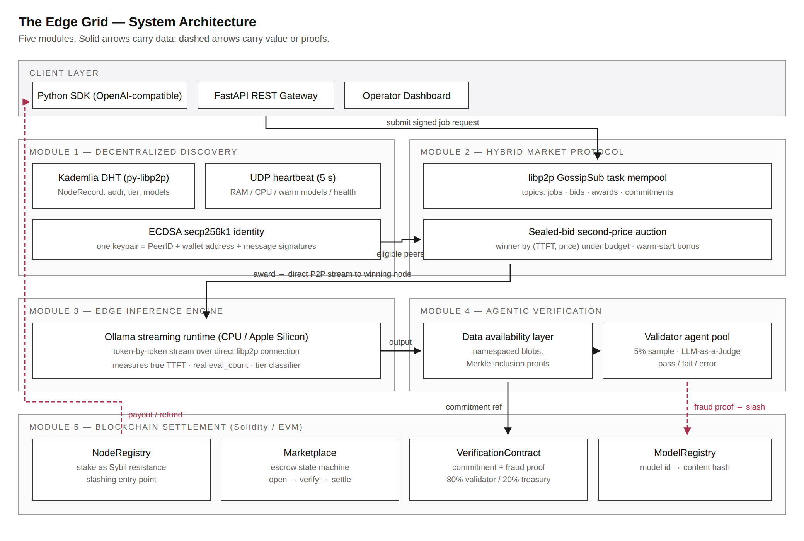
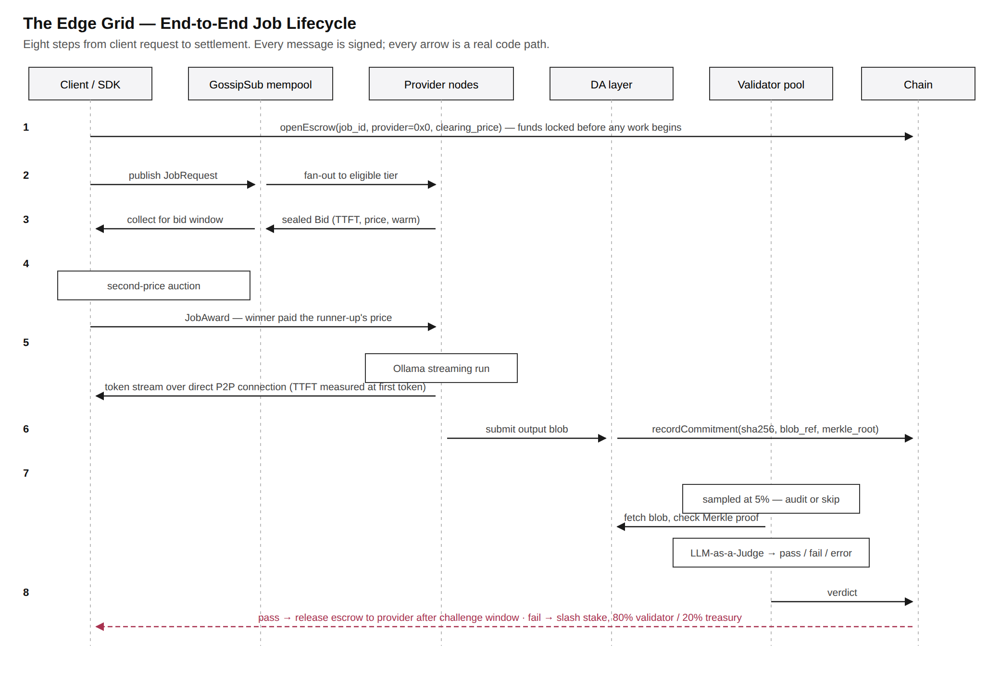

# The Edge Grid

**DePIN-Edge — a Decentralized Physical Infrastructure Network for localized, verifiable AI inference.**

A request enters the network, is auctioned to the peer that can serve it fastest, executed on
consumer hardware, committed to a data-availability layer, sampled for verification by an
LLM-as-a-Judge, and settled on chain — with the provider's stake slashed if the output was
fraudulent. No central directory, no central scheduler, no central payment rail.

BE final-year project, Dept. of CSE (IoT, Cyber-Security and Blockchain Technology),
Sir M. Visvesvaraya Institute of Technology, VTU Belagavi. Academic year 2026–27.

| | |
|---|---|
| **Team** | Harshit Raj (1MV23IC021) · Chetan Raghuvanshi (1MV23IC013) · Keshav Narayan (1MV23IC023) · Mayur Agarwal (1MV23IC028) |
| **Guide** | Dr. Savita Choudhary, Professor & Head |

---

## Quick start

```bash
./setup.sh                                    # venv, python deps, hardhat, ollama model
.venv/bin/python -m pytest tests/ -q          # the whole test suite
```

`setup.sh` handles two non-obvious build problems so you do not have to: py-libp2p pins
`fastecdsa==2.3.2`, which ships no CPython 3.12 wheel and needs `gmp.h`; and that build then
mis-links against a static `libgmp.a`. The script fetches the headers without sudo and points
the linker at the shared library. Run `./setup.sh --check` to verify an existing environment.

---

## Architecture



Five modules, mapped to the five objectives of the Phase-1 design:

| Module | What it does | Where |
|---|---|---|
| **1 — Discovery** | Kademlia DHT over py-libp2p holding signed node records; ECDSA secp256k1 identity (one keypair = PeerID + wallet + signatures); UDP heartbeat for fast-changing state; hardware tier classifier | `discovery/` |
| **2 — Market protocol** | libp2p GossipSub task mempool; sealed bids carrying TTFT and price; **second-price** auction under a latency budget, with a warm-start bonus | `discovery/`, `edgegrid/market.py` |
| **3 — Inference** | Ollama streaming runtime measuring **true time-to-first-token**, real token counts from `eval_count` | `inference/` |
| **4 — Verification** | Namespaced DA blobs with real Merkle inclusion proofs; validator pool sampling at 5%; LLM-as-a-Judge returning pass / fail / **error** | `edgegrid/da.py`, `verification/` |
| **5 — Settlement** | Solidity contracts on an EVM chain: stake, escrow state machine, challenge window, fraud proofs, 80/20 slash split | `contracts/`, `edgegrid/ledger.py` |
| **Client layer** | OpenAI-compatible FastAPI gateway, Python SDK, operator dashboard | `gateway/`, `sdk/` |

The shared foundation every track builds on lives in `edgegrid/`: `schemas.py` (the wire
contract — pydantic, `extra="forbid"`), `identity.py`, `config.py`, `da.py`, `runlog.py`.
`shared/schemas.md` is generated from `schemas.py` and is never hand-edited.



---

## What is real, and what is a stand-in

Stated up front, because a declared limitation is worth more than a discovered one.

| Phase-1 design | This implementation | Why |
|---|---|---|
| Arbitrum Stylus (Rust → WASM) | Solidity 0.8.24 on a local EVM chain | No Stylus toolchain; the settlement *semantics*, access control and gas measurements are real |
| Celestia data availability | Local namespaced blob store with binary Merkle inclusion proofs | The **binding** property is real and tested; Celestia's availability guarantee under a decentralised validator set is not reproduced |
| vLLM + PagedAttention on CUDA | Ollama on CPU | No NVIDIA GPU on the development hardware |
| Fine-tuned judge | Off-the-shelf model as judge | No fine-tuning data or budget; accuracy is therefore a lower bound |
| Real economic stake | Test-value stake on a local chain | No mainnet deployment |

Everything above is implemented against the same interfaces as the production design, so
replacing a stand-in means reimplementing one module, not rewiring the system.

---

## Running it

```bash
# the full pipeline in one process (no network required)
.venv/bin/python experiments/run_all.py --help

# a real multi-process P2P network
.venv/bin/python discovery/run_network.py --nodes 3

# the gateway + operator dashboard
.venv/bin/python -m uvicorn gateway.app:app --port 8000   # then open http://localhost:8000

# contracts on a local chain
cd contracts && npx hardhat node &          # terminal 1
cd contracts && npx hardhat test            # terminal 2
cd contracts && npx hardhat run scripts/deploy.js --network localhost
```

---

## Experiments

Four experiments produce every number in the paper and the report. The protocol is
[`docs/EXPERIMENTS.md`](docs/EXPERIMENTS.md); the ground rules it enforces exist because the
Phase-1 run violated all of them.

1. **Latency** — TTFT, warm and cold, against a hosted baseline
2. **Auction convergence** — clearing time at 3, 4 and 5 nodes
3. **Verification accuracy** — judge precision/recall over injected fraud, plus judge
   self-consistency under paraphrase
4. **Cost and settlement** — grid cost per 1k tokens including verification overhead, on-chain
   gas, and a value-conservation check

Results land in `docs/results/<experiment>-<UTC>/` with a full config snapshot and git SHA.
Nothing overwrites a previous run.

---

## Repository layout

```
edgegrid/        shared foundation — schemas, identity, config, DA layer, run records
discovery/       Kademlia DHT, GossipSub mempool, auction, heartbeat, network launcher
inference/       streaming Ollama engine, benchmark, hardware tier classifier
verification/    LLM-as-a-Judge, validator pool, fraud injection, paraphrase consistency
contracts/       Solidity contracts, Hardhat tests, deployment scripts
gateway/  sdk/   OpenAI-compatible gateway, operator dashboard, client SDK
experiments/     the four experiments and figure generation
tests/           pytest suite across every track
docs/            report chapters, paper draft, figures, experiment protocol, results
```

## License

Academic project. See the report for citation of all third-party work.
